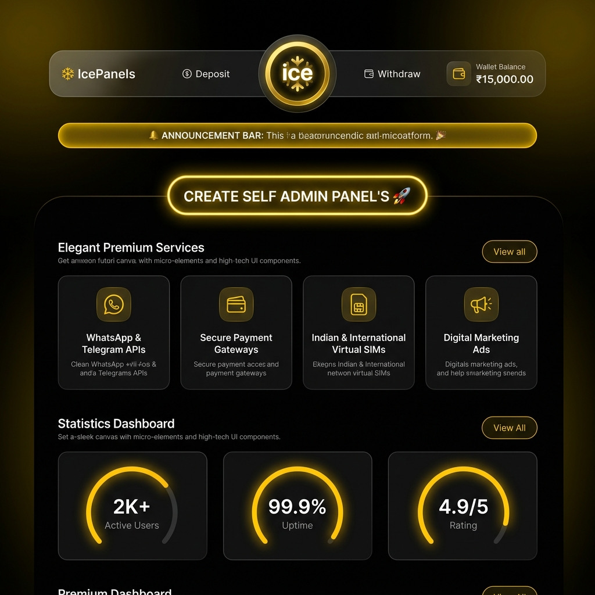
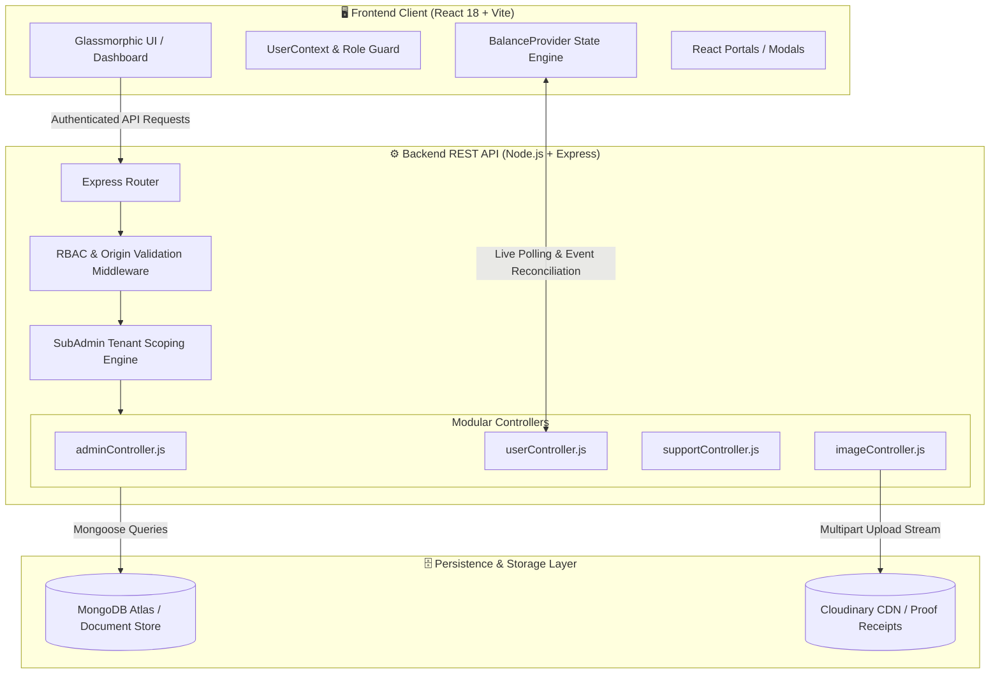

<p align="center">
  
</p>

<h1 align="center">IceUsers — Automated Self-Admin & Master Exchange Panel Provisioning Platform</h1>

<p align="center">
  <strong>A full-stack, multi-tenant web application engineered for a client to automate Self-Admin and Master panel creation, dynamic coin conversions, and instant wallet refills across 16+ top-tier online exchange platforms.</strong>
</p>

<p align="center">
  
  
  
  
  
  
  
  
</p>

---

> [!NOTE]
> **Engineering Portfolio Disclosure:**
> This repository contains a production full-stack platform architected and engineered by me on a **contract basis for a client**. This documentation is written from a **software engineering and system architecture perspective** to showcase full-stack development, multi-tenant isolation, state management, security workflows, and responsive UI craft for technical recruiters and hiring managers.

---

## 🎯 Accurate Project Use Case & Problem Statement

### The Real-World Domain Problem
In the online sports exchange and gaming ecosystem (featuring platforms like Radhe Exchange, Diamond Exchange, Laser247, King Exchange, etc.), agents and players traditionally acquire **"Self-Admin"** or **"Master Panels"** through manual, untrusted middlemen over messaging apps (WhatsApp/Telegram). This legacy approach introduces severe friction:
- **Fraud & Financial Risk:** Middlemen often manipulate coin conversion rates or disappear after receiving funds.
- **Delayed Delivery:** Provisioning credentials and topping up coins manually often takes hours.
- **Manual Bookkeeping:** Sub-agents struggle with tracking transactions, bank details, and customer balances.

### The Client Solution Built
To solve this, the client commissioned **IceUsers (The247Panel)**—an automated, 24/7 self-service platform that digitizes and secures the entire workflow:
1. **Self-Admin & Master Panel Creation:** Users can select from 16+ verified exchange websites, specify coin quantities, view real-time conversion rates (`1 INR = X Coins`), and request instant administrative panel credentials.
2. **Automated Wallet & Panel Refills:** Users deposit funds directly to their assigned Admin Master's verified banking/UPI gateway, upload proof of payment, and receive automatic wallet credits to refill their exchange panels.
3. **Multi-Tenant Sub-Admin (Admin Master) Hierarchy:** Independent master agents operate within their own isolated tenant silos—managing their private customer cohorts, setting custom coin pricing per exchange, and moderating their own deposit/withdrawal queues.
4. **Secure Credential Delivery:** Once approved by the assigned admin, administrative URLs, Master usernames, and passwords appear directly on the user's encrypted "My IDs" dashboard.

---

## 🎨 Visual Showcase & User Interface

The frontend is styled in a custom dark-glassmorphic aesthetic (`#090d16` canvas, `#130e24` card surface, and `#DB2777` magenta neon accents) with fluid backdrop-filter blurs and micro-interactions.

### 🖥️ Desktop & Landing Dashboard Preview



<p align="center">
  
</p>

---

### 🌐 Supported Exchange Platforms (16+ Integrated Targets)

The platform provides automated panel provisioning and coin rate calculations across 16+ major exchange networks:

| | | | |
|:---:|:---:|:---:|:---:|
| <br/>**Radhe Exchange** | <br/>**King Exchange** | <br/>**Diamond Exchange** | <br/>**Go Exchange** |
| <br/>**World777** | <br/>**Taj777** | <br/>**Laser247** | <br/>**Baazi888** |
| <br/>**The100 Exchange** | <br/>**All Panel Exch** | <br/>**Bikaji Exchange** | <br/>**BetOnly777** |
| <br/>**JSK1** | <br/>**PS777** | <br/>**T10 Exchange** | <br/>**Allow Exchange** |

---

### 🖼️ Promotional Carousels & Dynamic Creative Modules

The landing page features dynamic horizontal and square carousel modules managed via the administrative banner panel:

<p align="center">
  
  &nbsp;
  
</p>

<p align="center">
  
  &nbsp;
  
</p>

---

## 🛠️ Complete Technical Stack

### Client-Side (Frontend SPA)
| Technology | Role / Engineering Implementation |
| :--- | :--- |
| **React 18.3** | Functional components with concurrent rendering, custom hooks, and transition flags |
| **Vite 6.0** | Next-generation ESM bundler providing sub-second HMR and optimized production chunks |
| **React Router v6** | Client-side routing with role-gated routes (`ProtectedRoute`) and future v7 transition flags |
| **TailwindCSS 3.4** | Utility-first CSS framework configured with custom glassmorphism extensions |
| **CSS Modules** | Scoped, conflict-free component styling for complex layouts (`HomeHeading`, `Navbar`, `Popups`) |
| **Framer Motion 13.4** | Physics-based spring animations for slide-overs, interactive modals, and ticker elements |
| **Material UI (MUI)** | High-fidelity SVG icon library (`@mui/icons-material`), typography, and chip components |
| **PrimeReact & Flowbite** | Enterprise data tables, interactive popovers, toasts, and status badges |
| **React-Slick** | Touch-enabled multi-breakpoint carousels for promotional and announcement graphics |
| **React Portals** | Modal overlays mounted to `#modal-root` to bypass CSS stacking contexts and transform clipping |

### Server-Side (Backend REST API)
| Technology | Role / Engineering Implementation |
| :--- | :--- |
| **Node.js** | Asynchronous, event-driven server runtime |
| **Express 4.21** | RESTful routing architecture, JSON body parsing, and static file delivery |
| **MongoDB & Mongoose 8.18** | Schema validation, compound indexing, multi-tenant document isolation, and population |
| **Bcrypt.js** | Cryptographic password hashing (10 salt rounds) for tamper-proof credentials |
| **Multer & Cloudinary** | Multipart receipt uploads with automatic cloud CDN storage and compression |
| **Dynamic CORS Handler** | Whitelist validator supporting multi-domain production, staging, and localhost clients |
| **UUID (v11)** | Collision-free unique transaction reference keys for payment tracking |

---

## 🏗️ System Architecture & Multi-Tenant Workflow



---

## 🛡️ Role-Based Access Control & 13-Point Permission Engine

The platform operates on a hierarchical multi-tenant structure:

```mermaid
graph TD
    Super[👑 Superadmin] -->|Provisions & Audits| SubAdmin[🛡️ Admin Master / Sub-Admin]
    Super -->|Configures 13-Point Permissions| SubAdmin
    Super -->|Global View| GlobalData[All Users, Transactions & Catalogs]
    
    SubAdmin -->|Tenant Silo A| UserA1[User A1]
    SubAdmin -->|Tenant Silo A| UserA2[User A2]
    SubAdmin -->|Manages Isolated| GatewayA[Dedicated Banking Gateways]
    SubAdmin -->|Manages Isolated| CatalogA[Custom Exchange Catalog & Coin Rates]
    
    SubAdminB[🛡️ Admin Master B] -->|Tenant Silo B| UserB1[User B1]
    SubAdminB -->|Manages Isolated| GatewayB[Bank Gateways B]
    
    UserA1 -.x|Strictly Blocked Access| SubAdminB
```

### The 13-Point Granular Permission Matrix

Sub-Admins (Admin Masters) are governed by fine-grained boolean permissions stored in the `Admin` schema:

```javascript
// models/Admin.js
permissions: {
    canCreateUsers:        { type: Boolean, default: true  }, // Provision new user credentials
    canUpdateUserBalance:  { type: Boolean, default: true  }, // Direct wallet credit/debit adjustments
    canChangeUserPassword: { type: Boolean, default: true  }, // Reset assigned user credentials
    canDeleteUsers:        { type: Boolean, default: false }, // Destructive removal of user accounts
    canAddWebsites:        { type: Boolean, default: true  }, // Register new exchange targets
    canEditWebsites:       { type: Boolean, default: true  }, // Alter coin exchange rates & min coins
    canDeleteWebsites:     { type: Boolean, default: false }, // Remove websites from catalog
    canManageCategories:   { type: Boolean, default: true  }, // Categorize platform offerings
    canManageIdRequests:   { type: Boolean, default: true  }, // Accept/reject user ID provisioning
    canManageTransactions: { type: Boolean, default: true  }, // Approve/reject deposit & withdrawal proofs
    canEditIdCredentials:  { type: Boolean, default: true  }, // Update target website login/passwords
    canManageBanners:      { type: Boolean, default: false }, // Superadmin-restricted landing banners
    canManageSupportLinks: { type: Boolean, default: false }, // Edit WhatsApp, Telegram, Social channels
}
```

---

## 🔄 Step-by-Step Panel Creation & Refill Lifecycle

```mermaid
sequenceDiagram
    autonumber
    actor User as Client / User
    participant App as React Frontend
    participant API as Express API Server
    participant DB as MongoDB Cluster
    actor Admin as Assigned Admin Master

    User->>App: Navigates to "Create Self Admin Panel"
    User->>App: Selects Exchange (e.g. Radheexch) & enters coin count
    App->>App: Calculates cost via live rate (e.g. 1 INR = 1 Coin)
    App->>API: POST /api/user/request-id
    API->>DB: Validates wallet balance; deducts coins & creates IdRequest (Pending)
    API-->>App: 201 Created (Request queued)
    
    Admin->>App: Opens ID Request Queue (Tenant Scoped)
    Admin->>API: PATCH /api/admin/id-requests/:id/accept (Enters Panel URL, User, Pass)
    API->>DB: Updates status to 'Accepted'; saves credentials
    
    User->>App: Checks "My IDs" Dashboard
    App->>API: GET /api/user/my-ids
    API-->>App: Returns active panel list with decrypted login credentials
    App->>User: Displays interactive panel card with one-click copy & launch
```

---

## 💡 Developer Perspective: Key Technical Challenges Solved

### 1. Multi-Tenant Data Isolation & Query Scoping
* **Challenge:** In a tiered administrative hierarchy, independent Sub-Admins ("Admin Masters") must manage their own customer cohorts, exchange catalogs, and transaction queues without any risk of cross-tenant data exposure.
* **Solution:** Engineered a server-side tenant resolver (`subAdminHelper.js`) that dynamically extracts and verifies admin identifiers (`x-admin-id`, session tokens) from incoming requests, injecting strict isolation filters (`assignedAdmin`, `adminId`) across all Mongoose database queries to guarantee strict multi-tenant boundaries.

### 2. Atomic Wallet Balance Operations & Rate Reconciliation
* **Challenge:** Preventing race conditions and double-spending when users submit concurrent panel creation or refill requests while exchange rates fluctuate.
* **Solution:** Implemented atomic database operations (`$inc`, condition-guarded updates) and server-side rate re-validation before deducting wallet balances. Every transaction is tracked via unique UUID keys and dual-logged to the immutable ledger.

### 3. Asynchronous Proof-of-Payment Asset Pipeline
* **Challenge:** High-volume user receipt uploads (bank transfer screenshots) can degrade server throughput and consume excessive storage if handled synchronously on disk.
* **Solution:** Integrated a stream-based multipart upload pipeline using Multer connected directly to Cloudinary's CDN. Image buffers are uploaded, optimized, and converted to secure HTTPS URLs asynchronously, decoupled from local server storage.

### 4. Enterprise Dynamic Origin CORS Sanitization
* **Challenge:** The application runs across diverse production, staging, and custom client domains (`iceusers.info`, `the247panel.shop`, Vercel deploy previews) which cannot be solved safely with insecure `*` wildcard policies.
* **Solution:** Implemented an enterprise-grade dynamic origin verification middleware in Express using regex matching against authorized domain patterns, safeguarding credentials and cookies while maintaining multi-environment compatibility.

---

## 📁 Repository Directory Structure

```text
iceUsers/
├── backend/
│   ├── config/
│   │   ├── db.js                     # MongoDB connection handler
│   │   └── seedSuperAdmin.js         # Idempotent superadmin seeding script
│   ├── controller/
│   │   ├── adminController.js        # Multi-tenant admin business logic & audits (100KB+)
│   │   ├── authController.js         # Authentication, hashing, and token dispatch
│   │   ├── imageController.js        # Multer / Cloudinary asset upload processor
│   │   ├── subAdminHelper.js         # Tenant scoping & admin identifier resolvers
│   │   ├── supportController.js      # Dynamic multi-channel social links manager
│   │   └── userController.js         # User wallet, ID requests, and balance engine (35KB+)
│   ├── models/                       # 15 Mongoose schemas
│   │   ├── Admin.js                  # Superadmin & SubAdmin with 13-point permissions
│   │   ├── AdminAccount.js           # Multi-tenant banking & UPI configurations
│   │   ├── IdRequest.js              # ID creation lifecycle records
│   │   ├── Transaction.js            # Financial ledger entries (deposit/withdrawal)
│   │   ├── User.js                   # User accounts scoped to assignedAdmin
│   │   ├── WebsiteId.js              # Target exchange credentials
│   │   └── SupportLink.js            # Social links mapped per admin tenant
│   ├── routes/                       # Express route definitions
│   │   ├── adminRoutes.js            # Gated administrative endpoints
│   │   ├── authRoutes.js             # Public authentication routes
│   │   ├── imageRoutes.js            # Asset upload routes
│   │   ├── supportRoutes.js          # Support links API
│   │   └── userRoutes.js             # End-user profile and transaction routes
│   ├── server.js                     # Server entrypoint & dynamic CORS configuration
│   └── package.json
│
├── frontend/
│   ├── public/                       # Static public assets, icons, and logos
│   ├── src/
│   │   ├── assets/                   # SVG vectors, certifications, and exchange logos
│   │   │   └── websites/             # 16+ partner platform graphical assets
│   │   ├── components/
│   │   │   ├── admin/                # Administrative dashboard modules
│   │   │   │   ├── AdminAccountsDetails/ # Sub-admin banking manager
│   │   │   │   ├── AllIds/           # Global credential inspection table
│   │   │   │   ├── IdRequests/       # Responsive ID approval queue (Desktop/Mobile)
│   │   │   │   ├── SubAdmins/        # Superadmin sub-admin provisioner & permission toggles
│   │   │   │   ├── Users/            # Multi-tenant user audit & balance adjustment
│   │   │   │   └── Websites/         # Exchange catalog & coin rate configuration
│   │   │   ├── BalanceProvider/      # Global balance synchronization provider
│   │   │   ├── FloatingSocialWidget/ # Dynamic role-routed social support widget
│   │   │   ├── Home/                 # Landing dashboard, carousels, and headings
│   │   │   ├── Id/                   # User ID management & modal dialogs
│   │   │   ├── Login/ & Signup/      # Auth forms with inline validation
│   │   │   ├── Navbar/ & Sidebar/    # Responsive navigation with persistent collapse state
│   │   │   └── Transactions/         # Financial transaction history with proof view
│   │   ├── context/
│   │   │   └── UserContext.jsx       # Global session & authentication state
│   │   ├── utils/
│   │   │   ├── roles.js              # Role constants (`SUPERADMIN`, `ADMIN`, `USER`)
│   │   │   └── routes.js             # Centralized route dictionary
│   │   ├── App.jsx                   # Master routing table & layout assembly
│   │   ├── index.css                 # Design tokens, Tailwind directives, & glassmorphism
│   │   └── main.jsx                  # React DOM client entrypoint
│   ├── tailwind.config.cjs           # Custom color palette and media query definitions
│   └── package.json
│
├── readme_homepage.png               # High-resolution dashboard UI preview
└── README.md                         # Technical engineering documentation
```

---

## 🚀 Setup & Local Execution

### Prerequisites
* **Node.js**: v18.0.0+
* **npm** or **yarn**
* **MongoDB**: Local MongoDB instance or Atlas connection string

---

### 1. Backend Setup

```bash
cd backend
npm install
```

Create a `.env` file in `backend/`:
```env
PORT=5000
MONGO_URI=mongodb://localhost:27017/iceusers
JWT_SECRET=your_jwt_secret_key
CORS_ORIGINS=http://localhost:5173,http://localhost:3000
```

Start the backend:
```bash
npm run dev
```
*Initializes on `http://localhost:5000`. On first launch, `seedSuperAdmin.js` auto-creates the default Superadmin (`superadmin` / `Super@1234`).*

---

### 2. Frontend Setup

```bash
cd ../frontend
npm install
npm run dev
```
*Launches the Vite dev server at `http://localhost:5173`.*

---

## 📈 Recent Engineering Updates (Changelog)

- **Sub-Admin & User Management Engine (`00d94b4`):** Built controllers and routes to isolate user pools and assignable permissions for sub-admins.
- **Layout Width Overflow Fix (`74cdd4e`):** Fixed mobile horizontal scroll by migrating `100vw` to `100%` and rendering sidebars through React Portals.
- **Dynamic CORS Expansion (`7c86eb4`):** Extended CORS handling with regex matching for multi-domain production and preview deployments.
- **Dual-View Mobile ID Request UI (`b683e2f`, `a889eb8`):** Redesigned dense tables into responsive stacked cards below 880px down to 320px.
- **Coin Conversion Logic Refactor (`b53320b`, `6a5b776`):** Updated coin-to-currency formula safeguards and minimum threshold checks.
- **Scoped CSS Modules Migration (`6217c5c`):** Migrated navigation and header styling to CSS Modules to isolate glassmorphic styles.

---

<p align="center">
  <sub>Engineered on contract as a client full-stack application. Maintained strictly for engineering portfolio demonstration.</sub>
</p>
