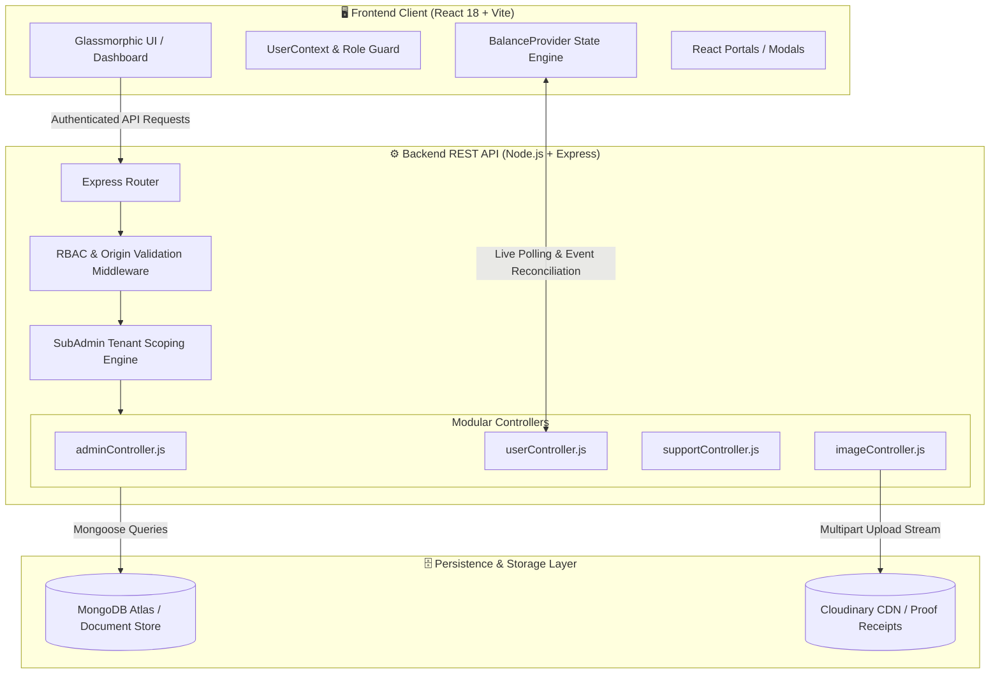
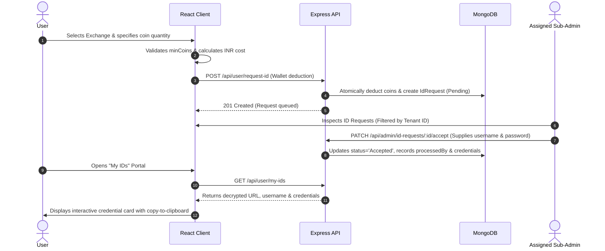

<p align="center">
  
</p>

<h1 align="center">IceUsers — Enterprise Multi-Tenant Credential Provisioning & Financial Ledger System</h1>

<p align="center">
  <strong>A full-stack, multi-tenant administrative portal engineered to automate credential management, wallet ledger transactions, and external platform provisioning with isolated sub-admin tenancy and a 13-point granular permission engine.</strong>
</p>

<p align="center">
  
  
  
  
  
  
  
  
</p>

---

> [!NOTE]
> **Engineering Portfolio Disclosure:**
> This repository contains a production-grade full-stack platform architected and developed by me as a **commissioned client engagement**. This document outlines the project strictly from an **engineering, systems architecture, and technical implementation perspective** to showcase full-stack problem-solving, multi-tenant state isolation, security workflows, and responsive UI engineering.

---

## 📌 Executive Summary & System Scope

The client required a unified, high-availability web platform capable of automating credential lifecycle operations (ID requests, password updates, account closures) and financial transactions (deposits and withdrawals) across 16+ third-party exchange platforms. 

The primary architectural challenges solved during development include:
1. **Multi-Tenant Sub-Admin Scoping:** Allowing independent master agents ("Sub-Admins") to operate within fully isolated tenant silos—managing their own user rosters, exchange catalogs, banking gateways, and support routes without cross-tenant data leakage.
2. **13-Point Granular Permission Matrix:** An administrative authorization system giving the Superadmin fine-grained control over Sub-Admin capabilities (user creation, balance adjustments, credential edits, transaction audits, and catalog management).
3. **Two-Way Financial Ledger & Verification Pipeline:** Automated coin-to-currency conversions (`1 INR = X Coins`), receipt upload handling via Cloudinary/Multer, and dual-state approval workflows.
4. **Adaptive Dual-View UI Architecture:** Designing complex administrative tables that automatically transform into high-density touch-optimized cards on mobile devices ($\le 880\text{px}$ down to 320px) with zero layout overflow.

---

## 🎨 User Interface & Design System

The application features a modern dark-glassmorphic aesthetic engineered with a custom tokenized palette (`#090d16` canvas, `#130e24` card surface, and vibrant `#DB2777` magenta neon accents), backdrop blur filters, and micro-interactions.

### Desktop & Dashboard Preview


### Integrated Partner Exchange Matrix

The platform integrates dynamic rate calculation and credential provisioning across 16+ external platforms:

| | | | |
|:---:|:---:|:---:|:---:|
| <br/>`Radhe Exchange` | <br/>`King Exchange` | <br/>`Diamond Exchange` | <br/>`Go Exchange` |
| <br/>`World777` | <br/>`Taj777` | <br/>`Laser247` | <br/>`Baazi888` |
| <br/>`The100 Exchange` | <br/>`All Panel Exch` | <br/>`Bikaji Exchange` | <br/>`BetOnly777` |
| <br/>`JSK1` | <br/>`PS777` | <br/>`T10 Exchange` | <br/>`Allow Exchange` |

---

## 🛠️ Complete Technical Stack

### Client-Side (Frontend SPA)
| Technology | Role / Purpose |
| :--- | :--- |
| **React 18.3** | Component-driven UI runtime utilizing concurrent rendering and transition flags |
| **Vite 6.0** | Ultra-fast ESM module bundler with optimized Hot Module Replacement (HMR) |
| **React Router v6** | Declarative client-side routing with role-gated `ProtectedRoute` guards and future v7 transitions |
| **TailwindCSS 3.4** | Utility-first responsive design framework configured with custom glassmorphism utilities |
| **CSS Modules** | Scoped, non-colliding style encapsulation for complex components (`HomeHeading`, `Navbar`, `Modals`) |
| **Framer Motion 13.4** | Physics-based spring animations for drawer transitions, modals, and list entry states |
| **Material UI (MUI)** | High-fidelity SVG icon library (`@mui/icons-material`), typography, and chip components |
| **PrimeReact & Flowbite** | Data table widgets, toast notifications, status badges, and interactive popovers |
| **React-Slick & Slick-Carousel** | Smooth multi-breakpoint banner carousels for promotional and announcement graphics |
| **React Portals** | Modal and drawer rendering directly into the document root to bypass z-index clipping contexts |

### Server-Side (Backend REST API)
| Technology | Role / Purpose |
| :--- | :--- |
| **Node.js** | Non-blocking, asynchronous event-driven server runtime |
| **Express 4.21** | Enterprise RESTful API routing, error middleware, and static asset delivery |
| **MongoDB & Mongoose 8.18** | Schema validation, compound indexing, population, and multi-tenant document queries |
| **Bcrypt.js** | Cryptographic password hashing (salt rounds = 10) for tamper-proof credential storage |
| **Multer & Cloudinary** | Multipart form handling and automated cloud image optimization for transaction receipts |
| **CORS Dynamic Origin Handler** | Dynamic regex origin validation supporting multi-domain production, staging, and localhost clients |
| **UUID (v11)** | Unique, collision-resistant transaction reference key generator |

---

## 🏗️ System Architecture & Data Flow



---

## 🛡️ Multi-Tenant Architecture & RBAC

The system implements a tiered role hierarchy designed to strictly isolate operations between distinct admin tenants:

```mermaid
graph TD
    Super[👑 Superadmin] -->|Provisions & Audits| SubAdmin[🛡️ Admin Master / Sub-Admin]
    Super -->|Configures 13-Point Permissions| SubAdmin
    Super -->|Global View| GlobalData[All Users, Transactions & Catalogs]
    
    SubAdmin -->|Tenant Silo A| UserA1[User A1]
    SubAdmin -->|Tenant Silo A| UserA2[User A2]
    SubAdmin -->|Manages Isolated| GatewayA[Dedicated Banking Gateways]
    SubAdmin -->|Manages Isolated| CatalogA[Custom Exchange Catalog & Coin Rates]
    
    SubAdminB[🛡️ Admin Master B] -->|Tenant Silo B| UserB1[User B1]
    SubAdminB -->|Manages Isolated| GatewayB[Bank Gateways B]
    
    UserA1 -.x|Strictly Blocked Access| SubAdminB
```

### The 13-Point Granular Permission Matrix

Sub-Admins are provisioned with schema-enforced boolean permissions stored on the `Admin` document:

```javascript
// models/Admin.js
permissions: {
    canCreateUsers:        { type: Boolean, default: true  }, // Provision new user credentials
    canUpdateUserBalance:  { type: Boolean, default: true  }, // Direct wallet credit/debit adjustments
    canChangeUserPassword: { type: Boolean, default: true  }, // Reset assigned user credentials
    canDeleteUsers:        { type: Boolean, default: false }, // Destructive removal of user accounts
    canAddWebsites:        { type: Boolean, default: true  }, // Register new exchange targets
    canEditWebsites:       { type: Boolean, default: true  }, // Alter coin exchange rates & min coins
    canDeleteWebsites:     { type: Boolean, default: false }, // Remove websites from catalog
    canManageCategories:   { type: Boolean, default: true  }, // Categorize platform offerings
    canManageIdRequests:   { type: Boolean, default: true  }, // Accept/reject user ID provisioning
    canManageTransactions: { type: Boolean, default: true  }, // Approve/reject deposit & withdrawal proofs
    canEditIdCredentials:  { type: Boolean, default: true  }, // Update target website login/passwords
    canManageBanners:      { type: Boolean, default: false }, // Superadmin-restricted landing banners
    canManageSupportLinks: { type: Boolean, default: false }, // Edit WhatsApp, Telegram, Social channels
}
```

Every administrative mutation route checks both the requesting admin's role and the specific capability flag via the tenant resolver before allowing database mutations.

---

## 🔄 Core Workflows & State Machines

### 1. ID Provisioning & Credential Lifecycle



### 2. Proof-of-Payment Verification Pipeline

```mermaid
stateDiagram-v2
    [*] --> DepositInitiated: User selects Admin Bank/UPI Account
    DepositInitiated --> ReceiptUploaded: User attaches payment screenshot
    ReceiptUploaded --> CloudinaryStored: Multer streams to Cloudinary CDN
    CloudinaryStored --> PendingVerification: Transaction logged with unique TXN ID
    
    state AdminModeration {
        PendingVerification --> Accepted: Admin verifies funds in banking app
        PendingVerification --> Rejected: Invalid transaction ID or falsified receipt
    }
    
    Accepted --> BalanceCredited: Atomic increment on User.balance
    Rejected --> LedgerLogged: Reason recorded; balance untouched
    BalanceCredited --> [*]
    LedgerLogged --> [*]
```



---

## 💡 Key Engineering Challenges & Technical Solutions

### 1. Dual-View Mobile Responsiveness ($\le 880\text{px}$)
* **Challenge:** Administrative panels demand data-dense tabular information (7+ columns including Transaction IDs, status badges, timestamps, receipt preview triggers, and action buttons). On screens below 880px down to 320px, horizontal scrolling degrades operator efficiency.
* **Solution:** Engineered a dual-render layout paradigm using CSS media queries and conditional markup:
  - **Desktop ($> 880\text{px}$):** Renders high-density data tables with fixed column ratios.
  - **Mobile ($\le 880\text{px}$):** Automatically swaps into stacked glassmorphic cards with copyable IDs, compact status chips, and accordion action panels.
  - **Layout Overflow Fix:** Eliminated horizontal page jitter by replacing root `100vw` rules with strict `100%` bounds and zero-margin wrappers.

### 2. React Portal Modals & Stacking Context Isolation
* **Challenge:** Heavy CSS transforms, sticky navigation headers, and backdrop filters created stacking context issues where modals and dropdowns were clipped or rendered behind sibling cards.
* **Solution:** Migrated all popups (`ChangePasswordModal`, `WebsiteDepositPopup`, `WalletWithdrawalPopup`) and dynamic drawers to React Portals (`ReactDOM.createPortal`), mounting them directly into dedicated DOM root containers (`#modal-root`). This guarantees flawless z-index layering regardless of DOM nesting depth.

### 3. Real-Time Balance Synchronization
* **Challenge:** Balance discrepancies between cached client states and backend ledger operations when users trigger multiple transactions or when admins adjust balances concurrently.
* **Solution:** Created a unified `BalanceProvider` React Context utilizing an event-driven polling and optimistic update model. Balance modifications trigger immediate UI reconciliation and background re-fetching to maintain absolute data integrity without requiring full-page reloads.

### 4. Dynamic Multi-Origin CORS Enforcement
* **Challenge:** The application is deployed across multiple staging, production, and custom domain names (`iceusers.info`, `the247panel.shop`, Vercel previews, local development ports).
* **Solution:** Implemented a dynamic origin validator using normalized string pattern matching and regex verification in `server.js`, securely authorizing legitimate cross-domain requests while rejecting unauthorized origins with explicit policy errors.

---

## 📁 Repository Directory Structure

```text
iceUsers/
├── backend/
│   ├── config/
│   │   ├── db.js                     # MongoDB connection handler
│   │   └── seedSuperAdmin.js         # Idempotent superadmin seeding script
│   ├── controller/
│   │   ├── adminController.js        # Multi-tenant admin business logic & audits (100KB+)
│   │   ├── authController.js         # Authentication, hashing, and token dispatch
│   │   ├── imageController.js        # Multer / Cloudinary asset upload processor
│   │   ├── subAdminHelper.js         # Tenant scoping & admin identifier resolvers
│   │   ├── supportController.js      # Dynamic multi-channel social links manager
│   │   └── userController.js         # User wallet, ID requests, and balance engine (35KB+)
│   ├── models/                       # 15 Mongoose schemas
│   │   ├── Admin.js                  # Superadmin & SubAdmin with 13-point permissions
│   │   ├── AdminAccount.js           # Multi-tenant banking & UPI configurations
│   │   ├── IdRequest.js              # ID creation lifecycle records
│   │   ├── Transaction.js            # Financial ledger entries (deposit/withdrawal)
│   │   ├── User.js                   # User accounts scoped to assignedAdmin
│   │   ├── WebsiteId.js              # Target exchange credentials
│   │   └── SupportLink.js            # Social links mapped per admin tenant
│   ├── routes/                       # Express route definitions
│   │   ├── adminRoutes.js            # Gated administrative endpoints
│   │   ├── authRoutes.js             # Public authentication routes
│   │   ├── imageRoutes.js            # Asset upload routes
│   │   ├── supportRoutes.js          # Support links API
│   │   └── userRoutes.js             # End-user profile and transaction routes
│   ├── server.js                     # Server entrypoint & dynamic CORS configuration
│   └── package.json
│
├── frontend/
│   ├── public/                       # Static public assets, icons, and logos
│   ├── src/
│   │   ├── assets/                   # SVG vectors, certifications, and exchange logos
│   │   │   └── websites/             # 16+ partner platform graphical assets
│   │   ├── components/
│   │   │   ├── admin/                # Administrative dashboard modules
│   │   │   │   ├── AdminAccountsDetails/ # Sub-admin banking manager
│   │   │   │   ├── AllIds/           # Global credential inspection table
│   │   │   │   ├── IdRequests/       # Responsive ID approval queue (Desktop/Mobile)
│   │   │   │   ├── SubAdmins/        # Superadmin sub-admin provisioner & permission toggles
│   │   │   │   ├── Users/            # Multi-tenant user audit & balance adjustment
│   │   │   │   └── Websites/         # Exchange catalog & coin rate configuration
│   │   │   ├── BalanceProvider/      # Global balance synchronization provider
│   │   │   ├── FloatingSocialWidget/ # Dynamic role-routed social support widget
│   │   │   ├── Home/                 # Landing dashboard, carousels, and headings
│   │   │   ├── Id/                   # User ID management & modal dialogs
│   │   │   ├── Login/ & Signup/      # Auth forms with inline validation
│   │   │   ├── Navbar/ & Sidebar/    # Responsive navigation with persistent collapse state
│   │   │   └── Transactions/         # Financial transaction history with proof view
│   │   ├── context/
│   │   │   └── UserContext.jsx       # Global session & authentication state
│   │   ├── utils/
│   │   │   ├── roles.js              # Role constants (`SUPERADMIN`, `ADMIN`, `USER`)
│   │   │   └── routes.js             # Centralized route dictionary
│   │   ├── App.jsx                   # Master routing table & layout assembly
│   │   ├── index.css                 # Design tokens, Tailwind directives, & glassmorphism
│   │   └── main.jsx                  # React DOM client entrypoint
│   ├── tailwind.config.cjs           # Custom color palette and media query definitions
│   └── package.json
│
├── readme_homepage.png               # High-resolution dashboard UI preview
└── README.md                         # Technical engineering documentation
```

---

## 🚀 Local Development & Setup Guide

### Prerequisites
* **Node.js**: v18.0.0 or higher
* **npm** or **yarn**
* **MongoDB**: A running local instance or MongoDB Atlas URI
* **Cloudinary Account**: (Optional, for production image hosting)

---

### 1. Backend Service Configuration

1. Clone the repository and navigate to `backend/`:
   ```bash
   cd backend
   ```
2. Install server dependencies:
   ```bash
   npm install
   ```
3. Create a `.env` configuration file:
   ```env
   PORT=5000
   MONGO_URI=mongodb://localhost:27017/iceusers
   JWT_SECRET=your_secure_development_jwt_secret_key
   CORS_ORIGINS=http://localhost:5173,http://localhost:3000
   
   # Optional Cloudinary Storage Configuration
   CLOUDINARY_CLOUD_NAME=your_cloud_name
   CLOUDINARY_API_KEY=your_api_key
   CLOUDINARY_API_SECRET=your_api_secret
   ```
4. Start the backend in development mode with auto-reload:
   ```bash
   npm run dev
   ```
   *The server will initialize on `http://localhost:5000`. On first run, the database auto-seeder provisions the default Superadmin credentials.*

---

### 2. Frontend Client Setup

1. Navigate to the frontend directory:
   ```bash
   cd ../frontend
   ```
2. Install client dependencies:
   ```bash
   npm install
   ```
3. Start the Vite development server:
   ```bash
   npm run dev
   ```
4. Launch your browser at `http://localhost:5173`.

---

## 📈 Recent Technical Updates & Engineering Changelog

* **Multi-Tenant Sub-Admin Architecture (`00d94b4`):**
  - Built dedicated `adminController.js` logic and route handlers to isolate sub-admin user pools and exchange catalogs.
  - Implemented the 13-point permission matrix with frontend switch toggles for dynamic capability control.
* **Layout Width & Viewport Overflow Fix (`74cdd4e`):**
  - Solved horizontal viewport jitter on mobile and desktop by replacing root `100vw` rules with `100%` and encapsulating drawer components.
  - Migrated sidebar navigation into a persistent collapse state backed by `localStorage` and portal rendering.
* **CORS Dynamic Origin Expansion (`7c86eb4`):**
  - Extended backend CORS configuration with regex pattern verification to support multiple staging, preview, and production domains seamlessly.
* **Dual-View ID Request & Transaction Redesign (`b683e2f`, `a889eb8`):**
  - Refactored administrative table views into auto-collapsing cards on viewports $\le 880\text{px}$ to guarantee touch optimization and zero horizontal clipping.
* **Coin Rate & Financial Math Refactor (`b53320b`, `6a5b776`):**
  - Enhanced currency-to-coin calculation logic with dynamic minimum requirements and validation safeguards against negative or zero values.
* **Scoped CSS Modules Migration (`6217c5c`):**
  - Adopted CSS Modules for `HomeHeading` and `TopNavbar` components to isolate complex glassmorphic keyframes and prevent style bleeding.

---

## 👨‍💻 Developer Summary

* **Role:** Full-Stack Software Engineer
* **Scope of Work:** End-to-end architecture, database schema design, REST API implementation, multi-tenant RBAC engine, frontend UI/UX engineering, and responsive optimization.
* **Key Focus Areas:** Scalable system design, component reusability, secure authentication patterns, and responsive performance.

---

<p align="center">
  <sub>Developed as a high-performance, client-commissioned web application. All technical designs and implementations presented here are for technical portfolio and engineering demonstration purposes.</sub>
</p>
